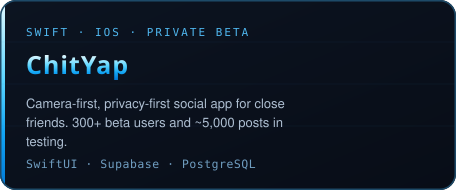
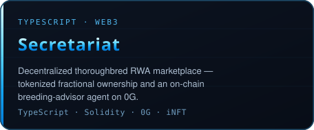
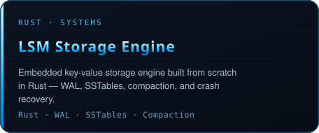
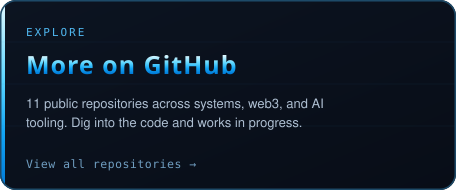
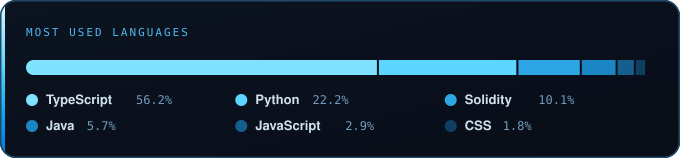

  

  

  
  &nbsp;
  
  &nbsp;
  

 

I'm an **AI student at Purdue** chasing the parts of computing that hold everything else up — storage engines, distributed systems, and the infrastructure that makes AI actually run at scale. I like going low: writing a database from scratch, understanding a system down to its crash-recovery path, and shipping real products people use along the way. Always learning, always building something a little harder than the last thing.

 

- Building an **LSM-tree storage engine in Rust** from scratch — WAL, crash recovery, SSTables, compaction, and benchmarking
- Co-building **ChitYap**, a privacy-first social iOS app with 300+ beta users and nearly 5,000 posts
- Working on **AI / backend infrastructure** for automated financial due diligence
- Exploring **distributed systems, networking, and infrastructure for AI**

 

<table align="center" width="100%">
  <tr>
    <td width="50%"></td>
    <td width="50%"></td>
  </tr>
  <tr>
    <td width="50%"></td>
    <td width="50%"></td>
  </tr>
</table>

 

  

  

<!-- Snake contribution animation (generated by the GitHub Action in .github/workflows/snake.yml) -->

  

 

  SYSTEMS &nbsp;·&nbsp; DISTRIBUTED COMPUTING &nbsp;·&nbsp; AI INFRASTRUCTURE &nbsp;·&nbsp; BACKEND ENGINEERING

