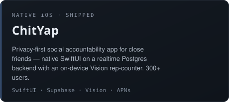
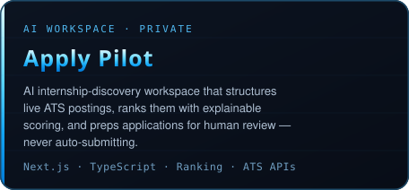
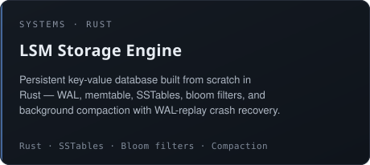
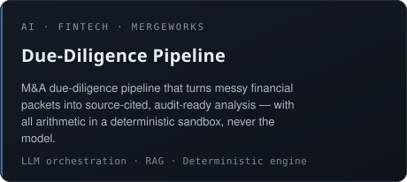
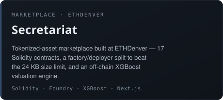
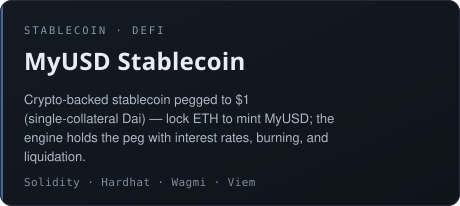
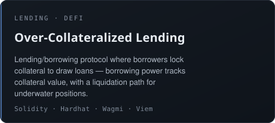
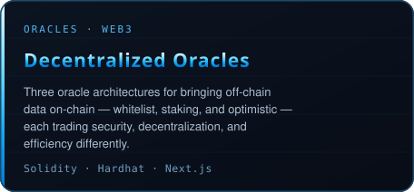
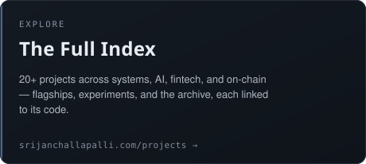

  

  

  
  &nbsp;
  
  &nbsp;
  

 

I'm an **AI student at Purdue** chasing the parts of computing that hold everything else up — storage engines, distributed systems, and the infrastructure that makes AI actually run at scale. I like going low: writing a database from scratch, understanding a system down to its crash-recovery path, and shipping real products people use along the way. Most recently I built an **M&A due-diligence pipeline at MergeWorks** that turns messy financial packets into source-cited, audit-ready analysis — keeping every number in a deterministic sandbox rather than the model. Always learning, always building something a little harder than the last thing.

 

- Building an **M&A due-diligence pipeline** at **MergeWorks** — messy financial packets → source-cited, audit-ready analysis, with all arithmetic in a deterministic sandbox, not the model
- Writing an **LSM-tree storage engine in Rust** from scratch — WAL, memtables, SSTables, bloom filters, and background compaction
- Shipped **ChitYap** to 300+ users; building **Apply Pilot**, an AI internship-discovery workspace with explainable ranking
- Exploring **distributed systems, AI infrastructure, and on-chain / DeFi**

 

<table align="center" width="100%">
  <tr>
    <td width="50%"></td>
    <td width="50%"></td>
  </tr>
  <tr>
    <td width="50%"></td>
    <td width="50%"></td>
  </tr>
</table>

 

<table align="center" width="100%">
  <tr>
    <td width="50%"></td>
    <td width="50%"></td>
  </tr>
  <tr>
    <td width="50%"></td>
    <td width="50%"></td>
  </tr>
</table>

  

 

  

<!-- Snake contribution animation (generated by the GitHub Action in .github/workflows/snake.yml) -->

  

 

  SYSTEMS &nbsp;·&nbsp; DISTRIBUTED COMPUTING &nbsp;·&nbsp; AI INFRASTRUCTURE &nbsp;·&nbsp; BACKEND ENGINEERING

